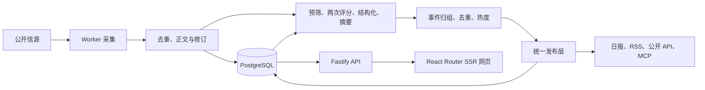

# 上游底层技术逻辑

上游版本：8ef28ebcd167b311ffab8c0308181e2912262ae2。来源：https://github.com/KKKKhazix/AIHOT 。

它把信息获取、内容判断和网页访问分开。核心是一条有状态的后台编辑流水线，页面读取已生成的结果。

## 1. 信息从哪里来

`industry/sources.json` 是首次启动时导入的信源清单，之后在后台维护。支持 RSS/Atom、网页列表、JSON 接口、X、微信公众号和外部推送。RSS/网页/JSON 的普通读取可以不调用付费服务；X、公众号及 Jina 等需要相应服务配置。框架默认附 18 个公开示范源，没有参考站的完整名单和历史数据库。

采集位于 `packages/backend/src/sources/`。`apps/worker/` 借助 PostgreSQL 中的 pg-boss 队列运行任务、定时抓取、重试和维护。失败时不推进采集位置，避免漏掉后续资料。

## 2. 如何入库和防止重复

所有新材料进入 `content/materials.ts`，统一处理 URL 身份、内容哈希、正文、修订和时间。URL 去重避免反复抓同一篇；内容变化会产生新修订。没有可信发布时间的资料不能把收录时间冒充原文日期。首次发现超过 48 小时的旧文和历史导入按原始日期归档，不能刷进今天或触发新闻推送。

## 3. 模型具体做什么

`editorial/analyze.ts` 先预筛是否属于 AI 领域。PASS 与 UNKNOWN 继续处理，BLOCK 不公开；UNKNOWN 继续处理并不代表 100% 相关。普通文章没有实际文本材料时等待补齐，不能只看标题编摘要。

同一份评分标准独立调用两次，以分数和是否达到两倍门槛决定候选。默认 T1 官方一手门槛 60、T1_5 门槛 65、T2 媒体与个人门槛 76。独立两次不等于采用两个不同的模型。

结构化同时提取分类、标签、主体及有出处的新闻事实。其后才写中文标题、摘要与推荐理由。提示词在 `industry/prompts/`，门槛在 `industry/selection.ts`，每一步的模型由 `site/models.ts` 与环境配置决定。

## 4. 什么才算一件事

`events/recall.ts` 等先用向量相似度或文字重合度召回候选，再由模型判断是否同一事件、后续进展或不同事件，并进行复核。精选除了分数，还要通过归组与新增信息判断。高分不自动代表新的新闻。

热度由 `events/hot.ts` 基于最近 48 小时独立参与方计算，每个参与方只计一次，按 24 小时半衰期衰减。热度不是浏览量，重复抓取不会抬高它。

## 5. 为什么网页加载不再调用模型

`publication/` 把原始材料、最新分析、人工更正和归组状态投影为可公开结果。Web、RSS、API、MCP、站点地图共用公开规则，撤回和全文授权能统一生效。

网页是 `apps/web/` 的 React Router 服务端渲染应用，通过 HTTP 调用 `apps/api/` 的 Fastify 服务。Web 不直接访问数据库，不携带模型密钥。所有模型调用在后台，读者打开文章只读已经处理好的结果。

日报按规则选编已确认事件，默认每日 08:00 出刊，本身不调用模型。周报和月报从日报汇编，模型仅写总述和部分栏目导读。

## 6. 花费和失败怎样控制

`providers/receipts.ts` 为付费请求记录回执，重试可复用已经获得的结果。各服务有分钟、小时、每日预算熔断。采集、模型、推送等安全阀只有显式 true 才开启。处理结果不完整或归组失败时等待处理并告警，不因为等得久就自动入选。

## 本地 MVP 怎样使用

保留完整引擎，修改站名、顶部导航和首页；搜索、分类、详情、主题、收藏沿用真实 API。`site/mvp/articles.json` 是少量人工核验的公开资料，`scripts/seed-mvp.ts` 仅向本地 *_mvp 库导入，经过原有入库和发布规则，无模型评分。自动采集和付费调用关闭。

信息获取的下一步是：用户确定信源与预算，解决本机 fake-IP DNS 与上游 SSRF 地址验证的兼容问题，校准筛选样本，再开启 Worker。不能为了采集便利放宽内网防护。近 30 天有效内容超过参考站须另取双方同窗口、同去重口径的证据，当前 MVP 尚未达到该内容规模。
